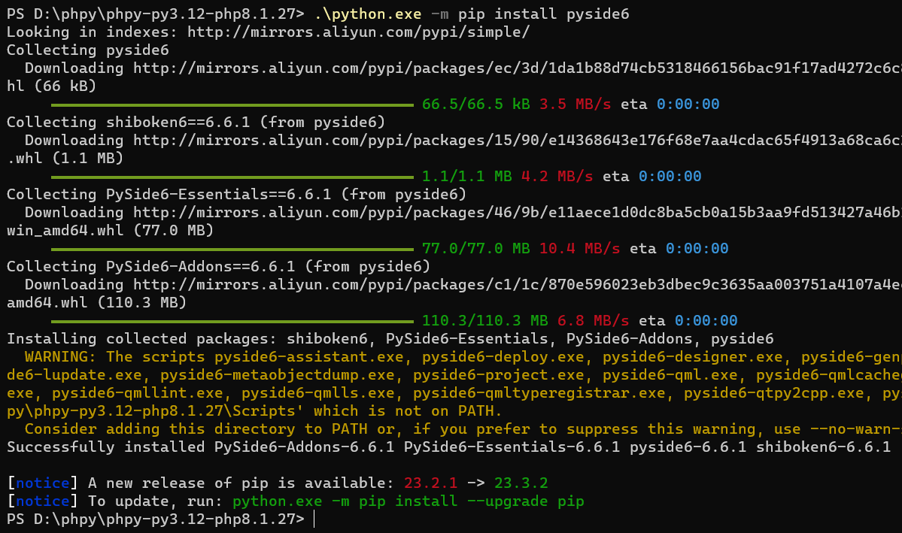
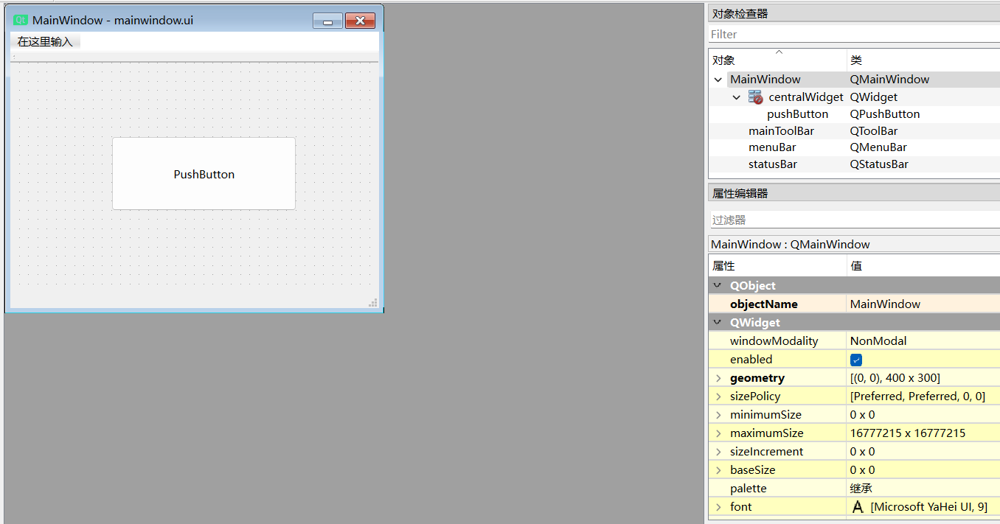
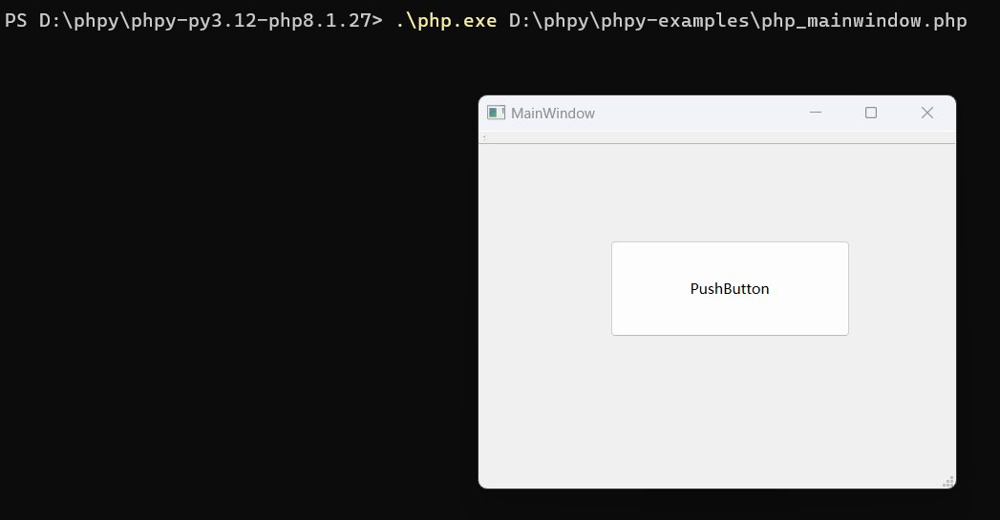

## 手把手教你玩qt
1. 从 [https://github.com/swoole/phpy/releases/tag/v1.0.3](https://github.com/swoole/phpy/releases/tag/v1.0.3) 下载 [phpy-1.0.3-win-x64-py3.12-php-8.1.27.zip](https://github.com/swoole/phpy/releases/download/v1.0.3/phpy-1.0.3-win-x64-py3.12-php-8.1.27.zip)，解压，放到 `D:\phpy`

2. 打开windows终端，进入 `D:\phpy\phpy-py3.12-php8.1.27`，执行 `.\python.exe -m pip install pyside6`


3. 执行 `.\Scripts\pyside6-designer.exe` 进入 `Designer`，简单创建个窗口，保存


4. 执行 `.\Scripts\pyside6-uic D:\phpy\phpy-examples\mainwindow.ui -o D:\phpy\phpy-examples\mainwindow.py` 导出py文件

5. 创建 `php_mainwindow.php`
```php
<?php

$sys = PyCore::import('sys');
$sys->path->append(__DIR__);

$QtWidgets = PyCore::import('PySide6.QtWidgets');
$MainWindow = PyCore::import('mainwindow')->Ui_MainWindow;

$app = $QtWidgets->QApplication($sys->argv);
$window = $QtWidgets->QMainWindow();

// php中无法继承python的类
$ui = $MainWindow();
$ui->setupUi($window);

$window->show();
exit($app->exec());
```

6. 执行 `.\php.exe D:\phpy\phpy-examples\php_mainwindow.php`，大功告成！


### 参考文档
- [https://doc.qt.io/qtforpython-6/quickstart.html](https://doc.qt.io/qtforpython-6/quickstart.html)  
- [https://doc.qt.io/qtforpython-6/tutorials/basictutorial/uifiles.html](https://doc.qt.io/qtforpython-6/tutorials/basictutorial/uifiles.html) 